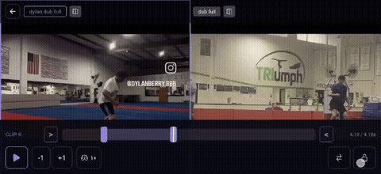

<p align="center">
  
</p>

<h1 align="center">Side By Side</h1>

<p align="center">A mobile app for comparing two videos side by side.</p>

## Features

- Record or import clips
- Organize a tagged, searchable library
- Compare two clips side by side or as an overlay
- Pan, zoom, and trim each clip independently
- Lock playback so both clips loop in sync

## Demo

<p align="center">
  <strong>Import</strong><br/>
  
</p>

<p align="center">
  <strong>Editing</strong><br/>
  
</p>

<p align="center">
  <strong>Locked playback</strong><br/>
  
</p>

## Running it

```bash
cd app
npm install
npx expo start
```
